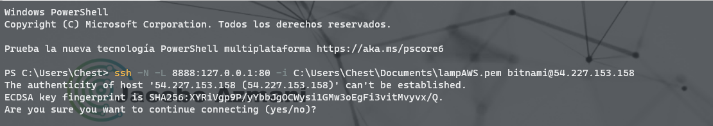

# IAW - Práctica 12
>IES Celia Viñas (Almería) - Curso 2020/2021   
>Módulo: IAW - Implantación de Aplicaciones Web   
>Ciclo: CFGS Administración de Sistemas Informáticos en Red 

## Práctica 12: Amazon Machine Image (AMI) de Bitnami para WordPress
En esta práctica tendremos que realizar la implantación del sitio [WordPress](https://wordpress.org/) en [Amazon Web Services (AWS)](https://aws.amazon.com/es/).

La **Amazon Machine Image (AMI)** que vamos a seleccionar para esta práctica será una **Community AMI** de **Bitnami** con la última versión de WordPress.

### Preparación e instalación
Tenemos que crear una máquina en [Amazon EC2](https://aws.amazon.com/es/), elegimos una **AMI** de [Bitnami](https://bitnami.com/) con **Wordpress** y elegimos la última versión disponible.
> Debemos de elegir una máquina con mínimos 2GB de RAM 

Elegimos una plantilla para lanzar nuestro Wordpress


Configuramos los puertos que vamos a abrir para para poder usar nuestra AMI.


Para poder acceder a nuestro sitio de Wordpress, debemos saber nuestro usuario y contraseña para el panel de administración. Para ello en nuestro sitio de **Amazon EC2**, elegimos nuestra **instancia**:
**Botón derecho del ratón / Monitoreo y solución de problemas / Obtener registros del sistema**


Desde nuestra IP pública podemos acceder al sitio creado


Con el usuario y contraseña que hemos conseguido desde la **instancia Amazon EC2** podemos acceder al panel de administración del sitio **Wordpress**.


Finalmente para conectar con **PhpMyAdmin** hay que realizar un **túnel SSH** desde nuestra máquina a la máquina de **Amazon EC2**-
- Orden ssh -N -L 8888:127.0.0.1:80 -i clave_aws.pem bitnami@ip_maquina
```
ssh -N -L 8888:127.0.0.1:80 -i C:\Users\Chest\Documents\lampAWS.pem bitnami@54.227.153.158
```


PhpMyAdmin

> Con las credenciales son **root** y la contraseña la misma con la que accedemos al sitio de **Wordpress** 


## REFERENCIAS
- [José Juan Sanchez](https://josejuansanchez.org/iaw/practica-12/index.html)
- [Jose Antonio Padilla](https://github.com/japsasir/iaw-practica-12)
- [SSH para PhpMyAdmin](https://docs.bitnami.com/aws/faq/get-started/access-phpmyadmin/)
